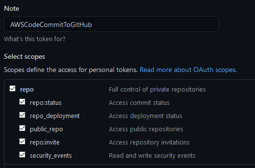

# AWSCodeCommitToGitHub
Migrate AWS CodeCommit repositories to GitHub

## How to install

1) Download one of the binary files:  
[Windows](https://github.com/otodorov/AWSCodeCommitToGitHub/releases/download/v1.0.1/AWSCodeCommitToGitHub_windows_386.exe)  
[Linux](https://github.com/otodorov/AWSCodeCommitToGitHub/releases/download/v1.0.1/AWSCodeCommitToGitHub_linux_386.bin)  
[MacOS](https://github.com/otodorov/AWSCodeCommitToGitHub/releases/download/v1.0.1/AWSCodeCommitToGitHub_drawin_amd64.bin)  

2) Create and save a configuration file called `AWSCodeCommitToGitHub.yml` similar to this [AWSCodeCommitToGitHub.yml](./AWSCodeCommitToGitHub.yml)
Both the binary and the configuration file have to be placed in the same location.

## How to create GitHub Access Token

Go to GitHub account [Settings -> Developer settings -> Personal access tokens -> Generate new token](https://github.com/settings/profile)

Give it a name and check :heavy_check_mark: everything under `repo` scope:

## Create an AWS access key (aws_access_key_id and aws_secret_access_key)

[How do I create an AWS access key?](https://aws.amazon.com/premiumsupport/knowledge-center/create-access-key/)  
[Managing access keys (console)](https://docs.aws.amazon.com/IAM/latest/UserGuide/id_credentials_access-keys.html#Using_CreateAccessKey)

## Create credentials for AWS CodeCommit repositories

[Setup for HTTPS users using Git credentials](https://docs.aws.amazon.com/codecommit/latest/userguide/setting-up-gc.html)
